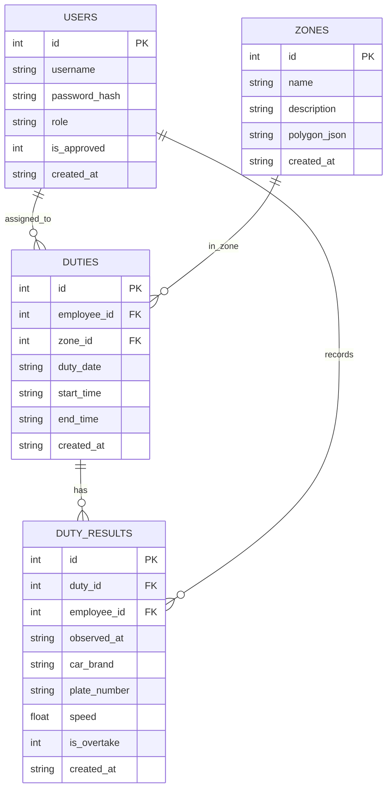
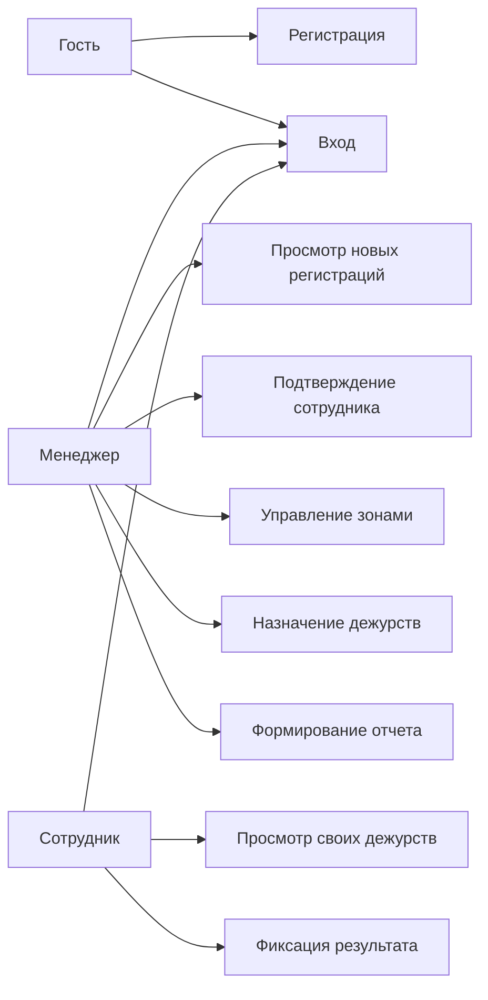
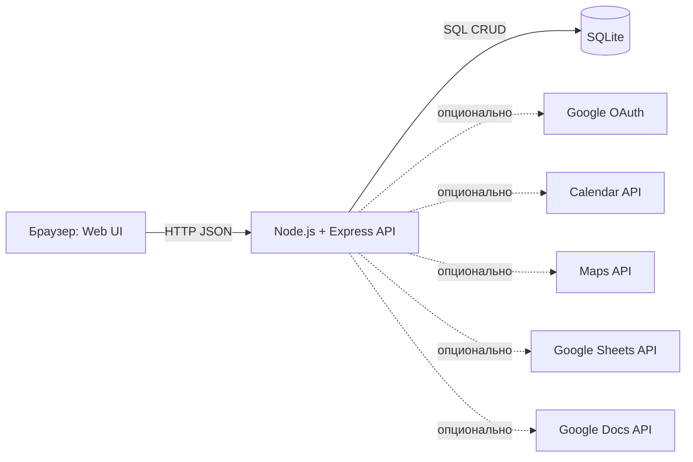
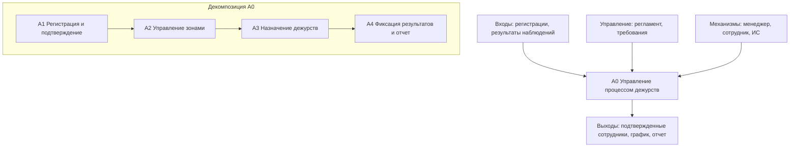

# Mermaid diagrams

## ER diagram

```mermaid
erDiagram
  USERS ||--o{ DUTIES : assigned_to
  ZONES ||--o{ DUTIES : in_zone
  DUTIES ||--o{ DUTY_RESULTS : has
  USERS ||--o{ DUTY_RESULTS : records

  USERS {
    int id PK
    string username
    string password_hash
    string role
    int is_approved
    string created_at
  }

  ZONES {
    int id PK
    string name
    string description
    string polygon_json
    string created_at
  }

  DUTIES {
    int id PK
    int employee_id FK
    int zone_id FK
    string duty_date
    string start_time
    string end_time
    string created_at
  }

  DUTY_RESULTS {
    int id PK
    int duty_id FK
    int employee_id FK
    string observed_at
    string car_brand
    string plate_number
    float speed
    int is_overtake
    string created_at
  }
```

## Use case

```mermaid
flowchart LR
  Guest[Гость] --> Reg[Регистрация]
  Guest --> Login[Вход]
  Manager[Менеджер] --> Login
  Employee[Сотрудник] --> Login
  Manager --> Pending[Просмотр новых регистраций]
  Manager --> Approve[Подтверждение сотрудника]
  Manager --> Zones[Управление зонами]
  Manager --> Assign[Назначение дежурств]
  Employee --> MyDuties[Просмотр своих дежурств]
  Employee --> FixResult[Фиксация результата]
  Manager --> Report[Формирование отчета]
```

## Deployment

```mermaid
flowchart LR
  Browser[Браузер: Web UI]
  API[Node.js + Express API]
  DB[(SQLite)]
  Browser -->|HTTP JSON| API
  API -->|SQL CRUD| DB
  API -.опционально.-> OAuth[Google OAuth]
  API -.опционально.-> Calendar[Calendar API]
  API -.опционально.-> Maps[Maps API]
  API -.опционально.-> Sheets[Google Sheets API]
  API -.опционально.-> Docs[Google Docs API]
```

## IDEF0 (context + level 1 decomposition)

```mermaid
flowchart TB
  I[Входы: регистрации, результаты наблюдений] --> A0[A0 Управление процессом дежурств]
  C[Управление: регламент, требования] --> A0
  M[Механизмы: менеджер, сотрудник, ИС] --> A0
  A0 --> O[Выходы: подтвержденные сотрудники, график, отчет]

  subgraph L1[Декомпозиция A0]
    A1[A1 Регистрация и подтверждение]
    A2[A2 Управление зонами]
    A3[A3 Назначение дежурств]
    A4[A4 Фиксация результатов и отчет]
    A1 --> A2 --> A3 --> A4
  end
```
